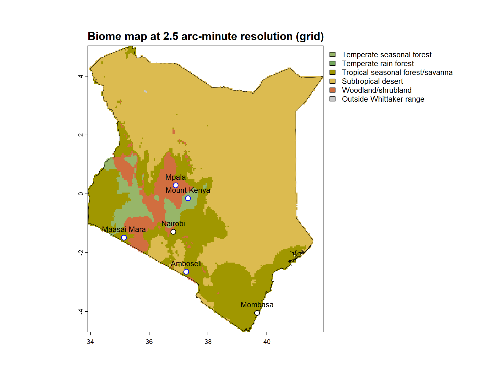

# Beyond a Map

The previous chapter built a map. A region polygon, `map_biomes()` to classify every cell, `plot_biome_map()` to draw the result: three steps, and what came back was a finished image, a region colored by biome. A finished image is where most map-making stops. It is not where a `biome_map` stops. The object those three steps build holds more than the picture drawn from it, and this chapter puts the rest of it to work.

It does that with a map of Kenya. Most readers have never stood in Kenya, and that is deliberate. A biome map is an abstraction, a classification draped over geography. An abstraction of a familiar place leans on what the reader already knows of it. An abstraction of an unfamiliar place has nothing to lean on, and has to be made legible by other means. Kenya is the honest test of whether a biome map can be made to mean something, and making it mean something is this chapter's subject.

The chapter takes a map of Kenya and works through four things. It marks the map with anchors, the known places that give an unfamiliar map a way in. It measures the map's composition, the share of the country each biome holds. It smooths the map's hard pixelated edges. And it ends on the matter of trust, how far a map like this should be believed, which is where the next chapter begins.

## Setup

```{r}
#| label: setup-beyond-map
#| message: false
## the whittakerr toolkit: map_biomes(), plot_biome_map(),
## smooth_biome_map(), biome_composition()
library(whittakerr)
## ggplot2 for the composition bar chart
library(ggplot2)
## read_csv() for the inline tables of anchor points
library(readr)
## formatted tables
library(gt)
## suppress read_csv() column-type messages for the whole chapter
options(readr.show_col_types = FALSE)
```

Every section of this chapter works from one biome map of Kenya. The previous chapter walked through the recipe; here it runs without comment. A whole country is a single GADM polygon, so there is no bounding-box crop to do. The `exists()` test rebuilds the map only if it is not already in memory, so the chapter can be opened and run on its own.

```{r}
#| label: beyond-map-kenya
## rebuild the Kenya biome map only if an earlier run has not
## already left it in memory
if (!exists("kenya_map")) {
  ## a whole country is one GADM polygon: level 0, no crop
  kenya     <- geodata::gadm(country = "KEN", level = 0,
                             path = "cache/gadm_cache")

  ## classify every cell at 2.5-arcminute resolution
  kenya_map <- map_biomes(region_polygon = kenya,
                          resolution     = 2.5)
}
```

## Anchors

The Kenya map is built, and as it stands it is hard to read. It is a field of colored cells inside the outline of a country. The colors stand for biomes and the outline stands for Kenya, and for a reader who does not already carry a map of Kenya in mind, that is very nearly all it says. Where on it is the coast? Where is the capital? Which colored region is the dry country, and which is the grassland the wildlife films are shot in? The map cannot answer. Its abstraction, which is the whole point of it, is also, left alone, its limit.

An anchor closes that gap. An anchor is a known place fixed on the map by name. It works by converting a patch of the abstraction into a patch of the known: "this is the biome Nairobi sits in" is a sentence a reader can hold and reason with, where "this is the pale region in the south center" is not. A point overlay of this kind is a teaching device, not a decoration. It is what ties a reader's experience of a region to the abstractness of the biome map, and the anchors that serve best are the places already intrinsic to how a region is understood — a capital, a great port, the conservation lands a country is known for.

For me those places are not abstract. I have been to Kenya twice and traveled much of it: the night milk train down from Nairobi to Mombasa, the coast out to the old island town of Lamu, and time on the Maasai Mara among the animals. On the map the Mara is one point and a label. To me it is also the smell of elephant carried on the wind, and a question I opened a biology class with for years — walking near elephants, do you watch where you step? An anchor carries that whole freight for someone who has stood in the place. For a reader who has not, it carries the start of it: a name, a position, a biome worth being curious about. Either way the bare classification becomes a place.

The Kenya map takes anchors of two kinds, and draws them so the two are told apart. The first kind is cities: Nairobi, high in the country near its center, and Mombasa, on the southern coast. The second is conservation land and the science done on it — the Maasai Mara and Amboseli, two of the reserves Kenya is known for; Mount Kenya National Park, on the mountain this chapter returns to later; and the Mpala Research Centre, a working ecological field station in the Laikipia highlands. The two kinds go into one table, with a `color` column that draws cities in black and the conservation anchors in blue.

```{r}
#| label: anchors-table
## the anchor places, in two kinds, each drawn in its own
## color: cities in black, conservation land and the field
## station in blue
anchors <- read_csv(
  "label,        lon,    lat,    color
   Nairobi,      36.82,  -1.29,  black
   Mombasa,      39.67,  -4.05,  black
   Maasai Mara,  35.14,  -1.49,  blue
   Amboseli,     37.26,  -2.65,  blue
   Mount Kenya,  37.32,  -0.15,  blue
   Mpala,        36.90,   0.29,  blue")

## show the anchor table
gt(anchors)
```

The table carries the two columns `plot_biome_map()` requires, `lon` and `lat`, and two more it uses when they are present: `label`, the name to write by each mark, and `color`, the point color. Passing the table to the `points` argument draws the anchors; the biomes themselves are named in the map's legend.

```{r}
#| label: anchors-map
#| eval: false

## draw the Kenya map with the anchors overlaid
plot_biome_map(kenya_map,
               points = anchors,
               file   = "images/kenya_biomes_anchored.png")
```



Now the map can be read. Mombasa fixes the hot, humid southern coast; Nairobi, set high in the interior, fixes the cooler central highlands; the Maasai Mara and Amboseli fix the southern grassland and savanna plains; Mpala and Mount Kenya fix the Laikipia highlands and the mountain the country is named for. Follow the six anchors and the colored field resolves into a country with a structure — a warm wet coast, a cool high interior, broad plains across the south, drier land reaching north. The biome each anchor sits in can now be read, named, and questioned.

That last word matters. An anchor is also a check. Anyone who has stood in a place can weigh the biome the map gives it against the heat, the rain, the vegetation they remember; a reader who has only learned that Mombasa is hot and wet can weigh it just as well. The anchors are at once the way into the map and the means of testing it, and the chapter takes up that second use at its end. For now they have told us where the biomes are. They have not told us how much. The next section measures that.

## Measuring the map

The Anchors section read the map as a picture, and asked of it a picture's question: where is each biome? The same `biome_map` answers a different kind of question, and answers it as a number rather than a position. How much of Kenya does each biome cover? A picture answers that one badly. The eye is poor at comparing areas, especially the odd, scattered shapes a biome map is made of. It is a question for a measurement.

`biome_composition()` is the measurement. The Retrieving Biome Information chapter already used it once, to give a single retrieved point its regional context — to say whether a point's biome was the common surround or a rare pocket. Here the same function does something closer to its center of gravity. It describes a whole region in its own right. Given the Kenya map, it returns one row per biome, each with the biome's mapped area and its share of the country, ranked from the most extensive to the least.

```{r}
#| label: composition
## measure the biome composition of the Kenya map
kenya_composition <- biome_composition(kenya_map)

## show the measured composition
gt(kenya_composition)
```

A column of percentages is exact but hard to take in. The same numbers read at a glance as a chart: one horizontal bar per biome, ordered by size, each bar filled with the biome's own color from the map.

```{r}
#| label: composition-chart
## one color per biome, matching the map; the fixed gray is
## kept ready in case any land falls outside the Whittaker scheme
bar_colors <- setNames(biome_palettes$ricklefs, biome_palettes$biome)
bar_colors["Outside Whittaker range"] <- "#C8C8C8"

## a horizontal bar chart, biomes ordered by their share
ggplot(kenya_composition,
       aes(x = percent, y = reorder(biome, percent), fill = biome)) +
  geom_col() +
  scale_fill_manual(values = bar_colors, guide = "none") +
  labs(x = "Percent of mapped area", y = NULL,
       title = "Biome composition of Kenya") +
  theme_minimal()
```

The chart characterizes Kenya in one view. The longest bars are the dry and seasonal biomes — the arid country of the north and east, the broad savanna belts — and the moist, forested biomes fall well below them. This is worth a pause. The popular picture of Kenya, the one the wildlife films supply, is green plains under flat-topped acacias. The composition corrects it: by area, Kenya is mostly dry country. A careful reading of the map's colors said as much already; the composition turns the impression into a measurement, and a measurement is harder to wave away.

This is the deeper use of `biome_composition()`. For a study built on a quantitative question — how much of a country a biome covers, or how that share would move under a projected climate — the ranked breakdown is not an accessory to the map. It is the result. The map shows the country and the composition measures it, and for many purposes the measurement is the product while the picture is only how you reached it.

Reading the map and measuring it have something in common. Both took the map exactly as `map_biomes()` produced it: a grid of square cells, each holding one biome, their edges meeting at right angles. Neither use minded those edges. The anchors sat on top of them and the measurement counted straight through them. The next section is the first that does mind them. It turns from what the map says to how it looks, and asks whether the blunt square edges of the cell grid can be made to read like the boundaries of a real biome.
