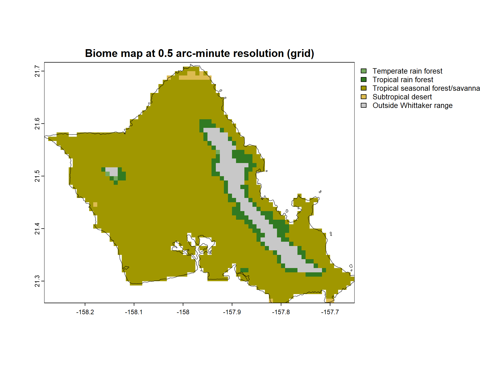
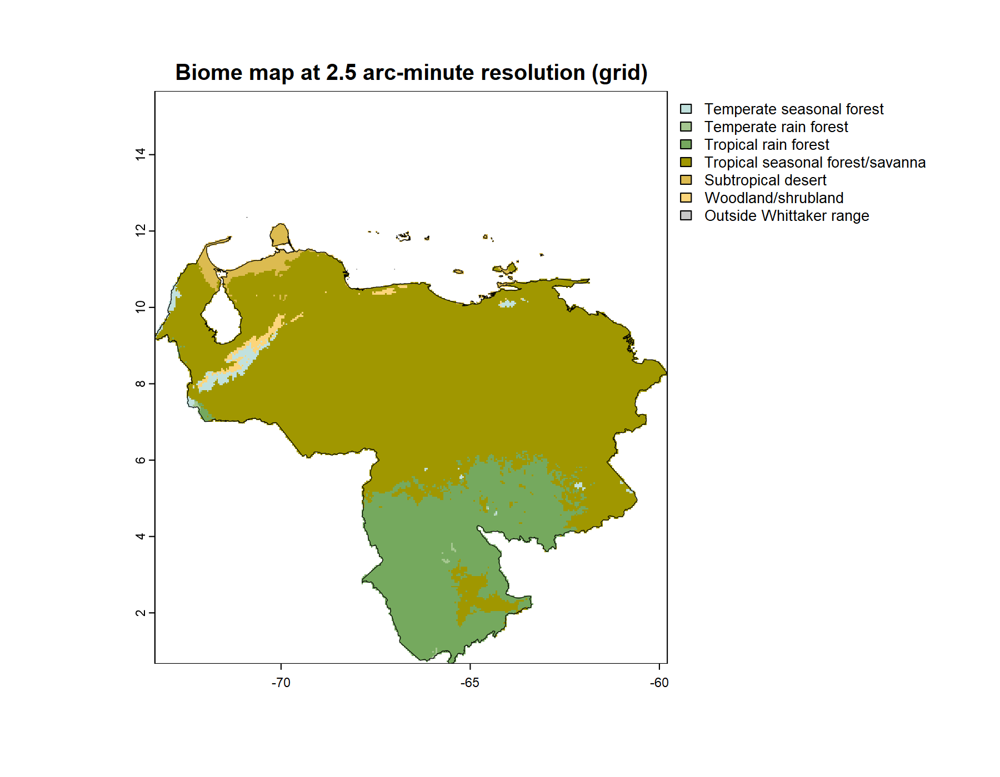

# Build a Map

Every chapter so far has worked, mostly, in the temperature-precipitation space of the Whittaker diagram. A point on that diagram is a climate, not a place. `get_climate()` starts from a place and returns its climate; `name_biome()` takes that climate and returns a biome. The motion has been from geography into the diagram.

A biome map reverses it. It takes the classification and lays it back down across real geography, not one place at a time but every place in a region at once. Earlier chapters borrowed a biome map once or twice in passing, to give a single point its regional context. This chapter and the next make map-making itself the subject.

This is the destination the whole document has been moving toward. The Whittaker diagram is the instrument, the intermediate. The map is the deliverable, the thing the instrument is for. The subject is large enough to take two chapters. This one builds the map. The next, "Beyond a Map," reads it, refines it, and puts it to use.

## Setup

```{r}
#| label: setup-build-map
#| message: false
## the whittakerr toolkit: map_biomes(), plot_biome_map()
library(whittakerr)
```

## What computing changed

A biome map of the kind this chapter builds was, for most of the history of ecology, not a casual thing to make. It was barely a thing to make at all.

I taught the first course in computer cartography at the University of Hawaii at Manoa. In those years the department's map-making still ran through a darkroom I had a key to: copy cameras, sheets of rubylith film, ruby-tipped cutters for scribing a coastline by hand. A single thematic map was days of careful, skilled, physical work. The difficult act of creating maps in the old days kept them from being created.

That constraint is easy to underrate. The maps an ecologist of Whittaker's generation might have wanted, biome distributions drawn over actual geography, the same region mapped under a future climate, the close study of a single ecotone, were not withheld by any shortage of ideas. They were withheld by the cost of drawing. A map that takes a week is a map you make only when you are already sure. Most maps worth making never cleared that bar.

Computing removed the bar. The map this chapter builds is a few lines of code. The climate data behind it downloads once and is then reused; after that, a map is a short computation. That cheapness is not a small convenience. It changes which questions are worth asking, because it changes which maps are worth making. A map you can make in a minute is a map you can make on a hunch, and discovery often starts with a hunch.

## The basic move

The function the earlier chapters borrowed without explaining is `map_biomes()`. Its idea is simple, and it is built directly out of tools the document has already used. Take a region. Lay a grid of cells over it. For every cell, retrieve the climate, exactly as `get_climate()` does for a point, and classify that climate into a biome, exactly as `name_biome()` does. The earlier chapters did this for a handful of cities. `map_biomes()` does it for every cell of a region, hundreds of cells for an island, many thousands for a continental state, and returns the result as a grid of biomes. Laid back down on geography, that grid is a map.

A map needs a region to cover. The region is a polygon, the outline of the country to be mapped, and the natural source is GADM, the database of global administrative areas, reached through the `geodata` package. The first worked example is Oahu.

```{r}
#| label: build-map-oahu-polygon
#| eval: false

## download (or load from cache) US county boundaries
us_counties <- geodata::gadm(country = "USA", level = 2,
                             path = "cache/gadm_cache")

## Oahu is part of Honolulu County, Hawaii
honolulu_co <- us_counties[us_counties$NAME_1 == "Hawaii" &
                           us_counties$NAME_2 == "Honolulu", ]

## Honolulu County legally includes the far Northwestern
## Hawaiian Islands; crop to the main island's bounding box
oahu_bbox <- terra::ext(-158.3, -157.6, 21.2, 21.8)
oahu      <- terra::crop(honolulu_co, oahu_bbox)
```

A small wrinkle here is worth noting, because it is typical of working with real administrative data. Honolulu County, as a legal entity, reaches far up the chain of the Northwestern Hawaiian Islands, so the county polygon covers far more open ocean than island. The bounding-box crop trims it back to the main island. Region polygons often need this kind of tidying. The map is only as clean as its boundary.

With a region in hand, `map_biomes()` does the classification.

```{r}
#| label: build-map-classify
#| eval: false

## classify every cell of Oahu at 30-arcsecond resolution
oahu_map <- map_biomes(region_polygon = oahu,
                       resolution     = 0.5)
```

The `resolution` argument sets the cell size. Here it is 0.5, which is 30 arc-seconds, cells of roughly one kilometer. That choice matters. A coarser grid would average Oahu's sharp windward-leeward contrast away, and a finer one is not available. The Scale chapter treats this trade in full; for Oahu, 30 arc-seconds is the resolution at which the island becomes a real map rather than a handful of cells.

`map_biomes()` returns a `biome_map`: a bundle holding the classified grid, the region polygon, and the labeling the map needs to be drawn or summarized. It is the object every later step works from.

```{r}
#| label: build-map-render
#| eval: false

## render the map and write it to a PNG file
plot_biome_map(oahu_map, file = "images/oahu_biomes.png")
```

`plot_biome_map()` draws the `biome_map`: each cell filled with its biome's color, the coastline traced, a legend naming the biomes present. The `file` argument writes the drawing straight to a PNG. Without it, the map is drawn to the screen instead.



The map repays a look. The windward side, the north and east coasts and the Koolau range that catches the trade winds, is wet, and classifies as rain forest. The leeward side, the south and west in the rain shadow, is dry. And in the driest pockets, the lee of the Waianae range, the area around Kawela Bay at the island's northern tip, near Kaloko Beach on the south coast and alongside Koko Head, the map shows subtropical desert.

That last result is the one worth pausing on. Hawaii is not, in the popular imagination, a place with deserts. But the climate envelopes are unsentimental: those pockets are warm and, by the measure of annual precipitation, genuinely arid, and they fall inside Whittaker's subtropical desert polygon. Hawaiian vegetation ecologists have long known these dry zones. The map found them from climate data alone, with nothing about Hawaii built in. It is a small but real case of the classification telling the truth against a common assumption.

## A place of your own

The Oahu map exercised the whole recipe, including one wrinkle, the county-polygon crop, that many regions never need. Most places are simpler. A whole country is a single GADM polygon, fetched in one call with nothing to trim, and the rest of the recipe does not change at all.

Venezuela is the example, at 2.5 arc-minutes, a resolution suited to a region this size. The whole map is one chunk:

```{r}
#| label: build-map-venezuela
#| eval: false

## a whole country is one GADM polygon: level 0, no crop
venezuela <- geodata::gadm(country = "VEN", level = 0,
                           path = "cache/gadm_cache")

## classify every cell at 2.5-arcminute resolution
venezuela_map <- map_biomes(region_polygon = venezuela,
                            resolution     = 2.5)

## render and save; palette = "ricklefs" is the default,
## named here so the figure's palette is never in doubt
plot_biome_map(venezuela_map,
               palette = "ricklefs",
               file    = "images/venezuela_biomes.png")

```



One argument in that call is worth a note. `plot_biome_map()` colors the biomes with a palette, and `palette = "ricklefs"` is the default. It is named explicitly above so the figure leaves no doubt which palette drew it. The Color chapter made the case in full: the Ricklefs palette follows landscape convention, but no single palette serves every map. Where a biome thins to a narrow sliver, as the temperate seasonal forest and the woodland do on this map, a pale Ricklefs color can be hard to pick out. Choosing a palette suited to a particular map is the Color chapter's subject; the point here is only where that choice goes. It is the `palette` argument, and changing it is changing one word.

The recipe needs one new piece of information for a new place: the country code. `geodata::country_codes()` lists every country with the three-letter code the `country` argument expects. To map a state or a province rather than a whole country, fetch the country at `level = 1` and read its `NAME_1` column for the available names, exactly as the Oahu example did one level deeper, at `level = 2`, to find a county by `NAME_2`.

The recipe that mapped Oahu mapped Venezuela with a few small changes: the region, the resolution, the output filename, and, if the default does not serve the map, the palette. To map a place of your own, change those. The recipe does not care which part of the world it is handed.

## Off the diagram

`map_biomes()` classifies every cell, but classification is not always possible, and the honest handling of that deserves a section of its own.

The Whittaker scheme is a bounded region of temperature-precipitation space, nine polygons within an envelope. It is not an exhaustive partition of all possible climates. A climate can fall outside every polygon, off the edge of the diagram entirely. When `name_biome()` meets such a climate it returns no biome; it reports the climate as outside the scheme.

A map cannot simply drop those cells. They are real land, inside the region, and leaving them blank would make them indistinguishable from ocean or from country outside the map. So `map_biomes()` records them as a category of their own, "Outside Whittaker range," and `plot_biome_map()` draws them in a fixed neutral gray, listed in the legend, plainly different from the white of out-of-region area.

This is not an error in the map. It is the map being honest. The case that made it concrete was Oregon. The cool, extremely wet cells of the Coast Range and the western Cascades receive more annual precipitation than the wettest corner of Whittaker's diagram allows. They are genuinely off the diagram. A map could hide that by forcing those cells into the nearest polygon, but the forced answer would be wrong, and quietly wrong. The gray cells say what is true, that here the climate is wetter than the classic scheme anticipated, and they let the reader see it. "Beyond a Map" returns to Oregon and shows this directly.

## The map is built

The map exists now. Three steps made it: a region polygon, `map_biomes()` to classify every cell, `plot_biome_map()` to draw the result. The same three steps build a map of any region GADM can supply, at any resolution WorldClim offers.

But a built map is a starting point, not a finished one. A finished map can be read more closely than this chapter has read its maps, by marking known places on it and by measuring how much of a region each biome holds. Its pixelated edges can be refined. And it raises a question it cannot answer on its own: how far should it be trusted? Those are the subjects of "Beyond a Map," which takes a finished map and puts it to work.
