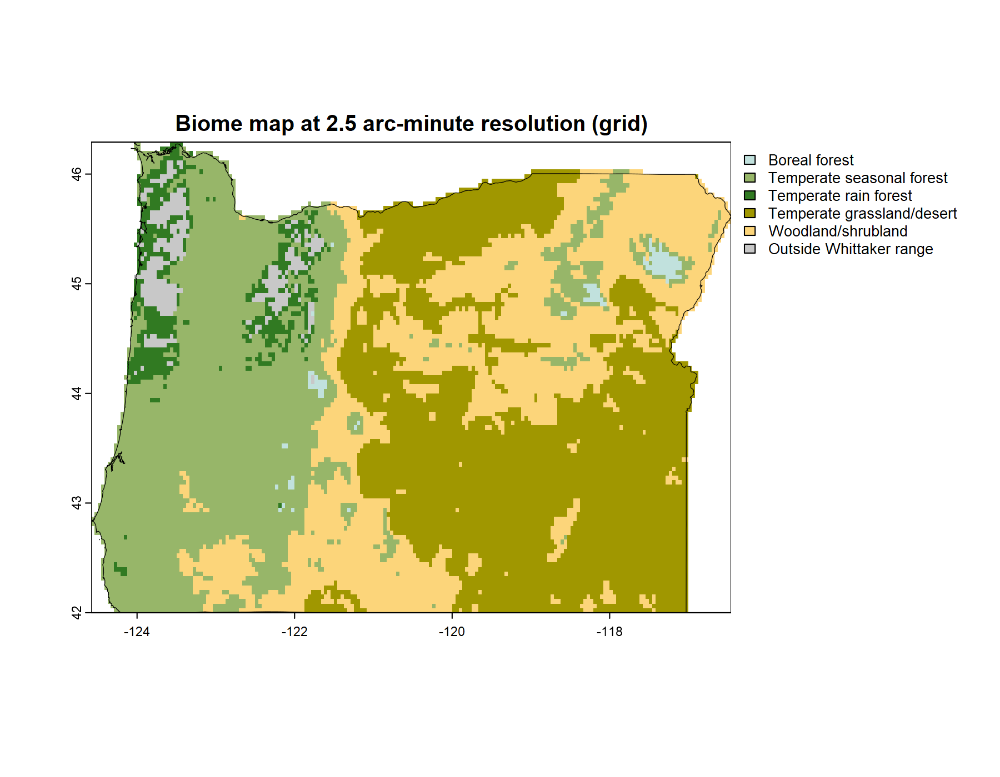
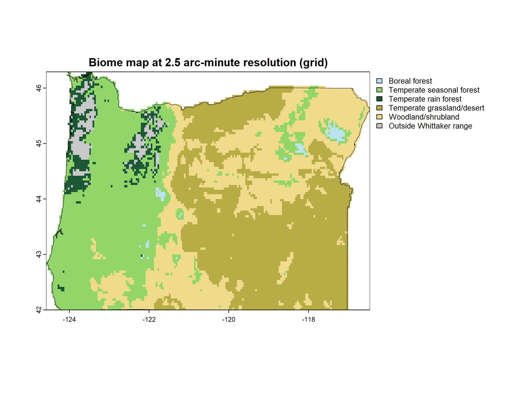

# Color: more than decoration

Every diagram in this document so far has arrived already colored, and the colors have gone unremarked. They could be taken for a decorative finish, something applied once the real work of drawing the biome polygons was done. They are not a finish. A palette is a design decision, and this chapter is about the decision.

The reason it's a decision, and not a matter of taste, is that a palette has two jobs, and the two jobs pull against each other. The first job is to be informative. The colors should carry meaning, so that a reader looking at the diagram understands something from the color itself, before consulting any legend. The second job is to be useful. Every category must be distinguishable from every other one, for every reader, in every medium the figure will pass through: a reader with color-vision deficiency, a grayscale photocopy, a dim projector. A palette can do the first job well and the second badly. It can also do the second well and carry no meaning at all.

This chapter argues that the palette is a real design problem, and that the problem has a particular shape. It's a tension between the informative and the useful, and it can't be resolved by choosing colors more carefully. The chapter follows that tension to its end. It examines the palette this document has been using, names the constraint that palette fails, lays the alternatives side by side, and arrives at a way out. The way out isn't a better palette. It's the recognition that color needn't carry the whole load.

## An iconic palette

The colors in this document's diagrams are neither arbitrary nor original. They come from the biome figure in Robert Ricklefs's ecology textbook, and that figure inherited them from a cartographic tradition older than the Whittaker diagram itself, running back through Whittaker, Holdridge, and the biome mapmakers before them. The tradition is consistent. Forests are green, with the darker greens reserved for the wetter and warmer types. Arid biomes are yellow and tan. Tundra and the cold types are pale blue and gray. The woodlands and shrublands that lie between get olives and khakis.

These aren't decorative choices. They're iconic choices, in the strict sense that the palette resembles the thing it represents. A temperate forest looks green from an airplane window. A desert looks tan from a satellite. Tundra reads as pale and cold. A palette built on these resemblances recruits what the reader already knows about landscapes, so the color carries meaning before the legend is ever consulted. This is what it means, concretely, for a palette to be informative. The color isn't labeling the category from outside. It's showing the category's nature.

An iconic palette of this kind asks the eye to recognize rather than to decode. That's a real virtue, and not one to give up lightly. It's also, as the next section shows, expensive.

## Where the iconic palette fails

Print one of these diagrams on a black-and-white office copier, or hand it to a reader with red-green color-vision deficiency, a condition that affects roughly eight percent of men. The iconic palette begins to fail.

It fails in a specific and instructive way. The forest biomes are several: tropical rain forest, temperate forest, the cold coniferous forests. An iconic palette gives them all greens, because forests are green. But several greens sitting close together in color space are exactly what red-green color-vision deficiency can't pull apart, and exactly what a grayscale conversion flattens into near-identical shades. The feature that made the palette informative, its fidelity to the green-ness of forests, is the same feature that makes it fail to be useful. The two jobs aren't merely different. On this palette, they're in direct conflict.

That conflict is the chapter's subject, and it's worth stating in general terms. A palette earns its informativeness by following convention, and convention clusters colors according to the resemblances they encode: forests near other forests, because forests resemble each other. Usefulness asks for the opposite. It wants the colors spread as far apart as the hardest-constrained reader's color space allows, and it doesn't care what the colors mean. One requirement pulls the palette toward meaning, the other toward separation, and a set of nine colors can't be pulled both ways at once. Past a point, one gives way to the other.

The rest of the chapter works inside this tension. It first lays the candidate palettes one after another, each a different settlement of the same trade-off. Then it reaches the way out, which turns out not to be a palette at all.

## The candidate palettes

Three palettes follow. The first commits to being informative. The second and third commit to being useful, and pay for it in meaning. Seeing them in sequence is the point: the trade-off is easier to feel than to describe.

```{r}
#| label: color-setup
#| message: false

## the whittakerr package
## install once with: install_github("kimbridges/whittakerr")
library(whittakerr)

## graphics functions
library(ggplot2)

## formatted tables
library(gt)
```

The first palette is the one this document has used all along, the Ricklefs palette. It is the informative pole in its purest form. Run it on the bare diagram and the convention does its work.

```{r}
#| label: color-ricklefs
#| fig-cap: "The Ricklefs palette, the informative pole: color follows landscape convention."

## the iconic palette, the document's default
plot_biomes(palette = "ricklefs")
```

The forests carry greens, the arid biomes tans, the cold tundra a pale blue, exactly as a reader who has looked at a landscape would expect. The diagram can be read before the legend. That is the whole case for the iconic palette, and the figure makes it without comment.

Now the color-vision-deficient palette, Paul Tol's muted qualitative scheme. It is built for separation: every category is chosen to stay distinct under the common forms of color-vision deficiency, and it succeeds.

```{r}
#| label: color-cvd
#| fig-cap: "Paul Tol's muted qualitative palette: distinct for every reader, but no longer iconic."

## a palette built to survive color-vision deficiency
plot_biomes(palette = "cvd")
```

What it gives up is just as visible. The forests are no longer green, the desert no longer tan. The colors are distinct, but they are only distinct. They no longer say anything. A reader cannot guess a single biome from its color and must consult the legend for every one. The palette has bought usefulness with the whole of its meaning.

The grayscale palette makes the same trade against a harder constraint. It is built so the nine biomes survive a black-and-white reproduction, each biome a different lightness on an even ladder from pale to dark.

```{r}
#| label: color-grayscale
#| fig-cap: "The grayscale palette: nine lightness steps that survive black-and-white reproduction."

## a palette built to survive grayscale reproduction
plot_biomes(palette = "grayscale")
```

It too works, and it too is mute. Lightness can be ordered, so the grayscale palette can at least suggest a gradient; here the biomes run from the sparse cold types to the dense forests. But it cannot point to forest or desert. It identifies; it does not mean.

Three palettes, three settlements, and not one of them resolves the tension. The Ricklefs palette is informative and fails the constrained reader. The other two serve every reader and say nothing. Choosing among them is choosing which job to sacrifice. The chapter could end here, on that resigned note, except that the framing has been wrong. The question was never which palette. It was why a single channel should carry both jobs at once.

## A second channel

The tension held only because one channel was asked to do two jobs. Color was made to be informative and useful at once, and no set of nine colors can do both. The way out is not a better palette. It is a second channel. Let color keep the job it does well, carrying meaning. Give the other job, reliable distinction, to something else. That something else is a label.

A label on the diagram has to be small. The biome names are long; "Temperate seasonal forest" will not fit inside its polygon. So each biome gets a short abbreviation, built on a consistent pattern: a climate-zone stem (Tmp, Trop, SubTrop) joined to a vegetation stem (Fst for forest, Dsrt for desert, and so on). The pattern is the point. A reader who learns two or three abbreviations can read the rest. The full key is short:

```{r}
#| label: color-abbrev-key
#| tbl-cap: "The biome-name abbreviations used as diagram labels."

## the abbreviation key: full biome name and short label
biome_abbrev[, c("biome", "abbrev")] |>
  gt() |>
  cols_label(biome  = "Biome",
             abbrev = "Abbreviation")
```

With the key in hand, the label can go onto the diagram. And here the iconic palette returns. Serving every reader no longer means abandoning the Ricklefs greens. The diagram keeps them, and the label carries the distinction the colors cannot guarantee.

```{r}
#| label: color-ricklefs-labeled
#| fig-cap: "The Ricklefs palette with biome labels: the color carries meaning, the label carries identity."

## the iconic palette, now with biome labels
plot_biomes(palette = "ricklefs", biome_labels = TRUE)
```

The diagram now carries each biome's identity twice, once in the color and once in the label. By a strict reading of Edward Tufte's data-ink principle, that redundancy is waste: two marks for one fact. But the strict reading assumes one reader in one medium. The label is the channel that survives what the color cannot: the grayscale copy, the dim projector, the reader who cannot separate the greens. In an accessibility context the redundant channel is not waste. It is the design.

The second channel does more than back up the first. On the iconic palette the two agree: "Fst" sits on green, "Dsrt" on tan, so the label and the color say the same thing and the reader gets one coherent signal rather than two to reconcile. And because the abbreviations share systematic stems, they line up. The Trop labels gather on the warm side of the diagram, the Tmp labels in the temperate middle, the shared Dsrt suffix along the dry edge. The labels trace the diagram's own two axes. They do not only identify the biomes; they teach the temperature and precipitation logic of the classification, and they do it whether or not the color is there to help.

This is the resolution the chapter promised. The diagram is informative and useful at once, not because a perfect palette was found, but because the two jobs were given to two channels. Color does what color does well. The label does the rest.

## A map is a harder problem

The diagram is settled. But the diagram is not the only place a biome classification is shown. The other is the map, and on a map color meets a harder problem than the diagram ever posed.

The Whittaker diagram is a fixed shape. Its nine polygons have a settled size, position, and adjacency; a palette is designed against that one arrangement and is done. A map has no fixed shape. A biome on a map is a geographic region, and that region can be large or small, a broad solid field or a thin meandering sliver, and it differs on every map. The palette must hold across all of it. A color that works as a diagram polygon can vanish where its biome narrows to a few cells, or overwhelm the map where its biome covers half the state. This variable geometry is the new constraint, the same diagram-to-map shift the rest of the document is built on, now reaching color.

A map also decides what the palette must do. Take Oregon. It is mostly forest, with three forest types among its five biomes, so a palette for an Oregon map has to separate those greens sharply. The iconic palette does not. Its forest greens, close enough to read as one family on the diagram, crowd into near-sameness on a map where forest is most of what there is.

```{r}
#| label: color-oregon-ricklefs
#| eval: false

## the Oregon biome map under the iconic palette.
## oregon_map is built with map_biomes(); see the Mapping chapter.
plot_biome_map(oregon_map, palette = "ricklefs",
               file = "images/oregon_ricklefs.png")
```



The response is a palette built for this map. Two things make it possible. First, separation is a finite budget: nine colors hold only so much distinctness, and a palette is always an allocation of it. The question is only where to spend. Second, a regional map rarely needs all nine biomes. Oregon has five. That is not a loss but a freedom; the budget that would have been stretched across nine is concentrated on five. The custom palette spends it where this map needs it: the three forest types pushed far apart, the large quiet expanses given calm colors, the small meandering biomes given the salient ones.

```{r}
#| label: color-oregon-custom
#| eval: false

## the same map under the custom, purpose-tuned palette
plot_biome_map(oregon_map, palette = "custom",
               file = "images/oregon_custom.png")
```



That is the end of what the palette itself can do. It cannot be informative and useful for every map at the same time; it can be tuned, for one map and its biomes, and paired with the label for the rest. Purpose-tuning is the palette's last move, and it points past the palette. To tune a palette to a map assumes there is a map to tune it to, and making biome maps is a subject of its own. That is the next chapter.
