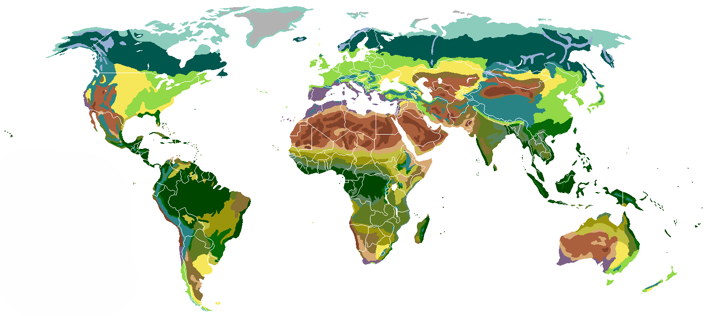

# History of Biome Identification

A biome is a way of describing the major vegetation and ecological character of a region. Biomes are familiar even to people without ecological training. The names match what we see: tropical rain forest, temperate grassland, tundra, boreal forest. The categories are intuitive and useful.

What is less familiar is that the idea of biome as a quantitative concept, mapped to climate, has a specific history. The way ecologists think about biomes today owes much to one researcher in particular: Robert Whittaker.

This chapter introduces Whittaker and his work, with attention to two ideas of his that changed how biology classifies and organizes the natural world. The first is the five kingdoms of life. The second is the biome diagram that this document is built around. Underneath both is a deeper contribution: a particular gift for the art of classification.

What follows in this chapter is the original work; what follows in the rest of the document is the verification that wasn't available to Whittaker himself.

## Robert Whittaker

Robert Harding Whittaker (1920–1980) was an American plant ecologist. His career moved across three institutions. He was at Brooklyn College from 1948 to 1968, then at Cornell University through most of the 1970s. He spent a period at UC Irvine; that's where I met him. His work shaped community ecology, classification, and the analysis of vegetation gradients. He died at 60, but his influence on ecology was already deep.

Whittaker's research style was careful and synthetic. He read widely, traveled to study sites across North America, and combined field observation with quantitative analysis. He developed gradient analysis methods that let ecologists study how vegetation changes along environmental axes like elevation and moisture. He worked on diversity concepts that distinguished local diversity from regional diversity, terms still standard in ecology today.

His textbook *Communities and Ecosystems*, first published in 1970 and revised in 1975, was where many ecologists first encountered modern community ecology in a single coherent treatment. The biome diagram that this document is built around appeared there.

I knew Whittaker. When he moved to UC Irvine late in his career, I was finishing my PhD in the same department. I was a teaching assistant for one of his classes, and later I did some statistics for him. He had presence in the way certain rare academics do. When he stepped to the front of a room, the room organized itself around him.

## The Five Kingdoms

Before the biome diagram made Whittaker influential among ecologists, an earlier paper made him visible more broadly. In 1969 he proposed a five-kingdom classification of life: Monera, Protista, Fungi, Plantae, and Animalia. Until then, most biologists divided organisms into two kingdoms (plants and animals) or three. The five-kingdom proposal recognized fundamental differences that earlier classifications had missed, especially the distinct nature of fungi and the importance of protists.

I attended his presentation of the five kingdoms in 1969. It was a stunning talk, both for the substance and for the delivery. The framework he laid out reorganized how the audience thought about the question by the end of the presentation.

The five-kingdom view became standard textbook material for several decades. It was eventually superseded by molecular phylogenetics, which produced three-domain and other schemes more consistent with evolutionary history. But the five kingdoms shaped how a generation of biologists thought about the highest levels of biological diversity. The work demonstrated something Whittaker would bring to his biome work as well: a willingness to step back from inherited categories and ask whether the lines we draw are the right ones.

## Two Views of Biomes

There are two related but distinct visualizations that come up when people talk about biomes. It helps to keep them separate from the start.

**The biome map** shows where biomes occur geographically.

The map answers a particular question: where on the Earth do we find tropical rain forest, or tundra, or temperate grassland? Tropical rain forests cluster near the equator. Boreal forests stretch across northern continents. Deserts occupy specific latitude bands. The map is biome-as-thing-in-the-world.

**The Whittaker diagram** answers a different question. Given a particular place's climate, which biome is it? The diagram plots biomes in a two-dimensional space. Mean annual temperature is one axis. Mean annual precipitation is the other. Each biome occupies a region of this space. Tropical rain forests sit in the warm and wet corner. Tundra sits in the cold and dry corner. Temperate grasslands, deserts, and forests fill intermediate regions.

Whittaker drew the polygons. He took a body of vegetation observations and a body of climate data and made the relationship visible. The polygons are abstractions. Real vegetation at a real site reflects soil, fire history, recent disturbance, and the legacy of past climates as well as the current temperature and precipitation. But the polygons capture a striking amount of variance with only two variables, and they do it in a way anyone can read.

The biome map and the Whittaker diagram are complementary. The map shows the result of climate constraining vegetation across the globe. The diagram shows the framework that makes that constraint legible. The rest of this document works mostly with the diagram side. Given climate data for a location, which biome does the location belong to, and what does that tell us?

## Classification as Art

The five kingdoms and the biome diagram are different in subject matter, but they share something underneath. Both are acts of classification. Both took an existing set of categories that everyone used, asked whether those categories were doing the right work, and proposed new boundaries that captured more of the underlying reality.

This is harder than it sounds. The categories we inherit feel natural because we have grown up inside them. Seeing past them requires a particular kind of stepping back. Then once you can see past them, proposing replacements that other people can adopt requires another kind of thinking, more architectural. The replacement must be cleaner than the original. It must hold up under cases the original handled awkwardly. It must be teachable.

Whittaker had both kinds of thinking. The five kingdoms reorganized the top of biological classification. The biome diagram reorganized how ecologists thought about climate and vegetation. Different problems, same gift. Classification, at its best, is a creative act, and Whittaker was a classification artist in the strongest sense of that phrase.

## Product versus Process

What we inherit from Whittaker is two products: the five-kingdoms framework and the biome diagram. The products are still in use, with various refinements. But the products are not really the deeper contribution. The deeper contribution is the process of producing them. The willingness to ask whether the categories are right. The patience to gather the evidence. The discipline to draw new polygons in a way that holds up.

This document is built around the biome diagram as a product. The chapters that follow show how to retrieve climate data, plot points on the diagram, identify the biome a point falls within, and explore the questions the framework supports. That is what you can do with what Whittaker handed us.

The more interesting work is to bring the process. As climate shifts, as new data becomes available, as questions appear that the existing biome polygons don't quite address, someone has to ask whether the polygons need redrawing, or whether new dimensions need adding, or whether the framework needs replacing. That is the kind of work Whittaker did. The product is the gift. The process is the inheritance.
